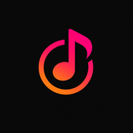

# Auramusic

<div align="center">



A modern Android music player with YouTube Music integration, powerful audio features, and a beautiful Material 3 interface.


</div>

## Features

| Category | Description |
|----------|-------------|
| **Playback** | Background playback, audio normalization, tempo/pitch adjustment, skip silence |
| **Streaming** | YouTube Music integration, offline downloads |
| **Customization** | Material 3 design, dynamic theming, light/dark/black themes |
| **Audio** | Equalizer, audio focus handling |
| **Social** | Discord Rich Presence, Listen Together (collaborative) |
| **Search** | Multi-source search across platforms |
| **Lyrics** | Live lyrics from Kugou, LRCLib, YouTube |

## Tech Stack

- **Language:** Kotlin
- **UI:** Jetpack Compose + Material 3
- **Audio:** Media3 ExoPlayer
- **DI:** Hilt
- **Database:** Room
- **Networking:** Ktor
- **Image Loading:** Coil

## Requirements

- Android 8.0+ (API 26)
- Android Studio Ladybug
- JDK 21

## Quick Start

```bash
# Clone the repository
git clone https://github.com/chila254/Auramusic-v1.git
cd Auramusic-v1

# Setup API keys (optional)
cp local.properties.example local.properties

# Build debug APK
./gradlew assembleDebug
```

## Build Variants

| Variant | Description |
|---------|-------------|
| `foss` | F-Droid compatible, no Google Play Services |
| `gms` | With Google Cast support |

**ABI Variants:** universal, arm64, armeabi, x86, x86_64

## License

GNU General Public License v3.0 (GPL-3.0) - see [LICENSE](LICENSE) file

---

## Special thanks

**InnerTune**
[Zion Huang](https://github.com/z-huang) • [Malopieds](https://github.com/Malopieds)

**OuterTune**
[Davide Garberi](https://github.com/DD3Boh) • [Michael Zh](https://github.com/mikooomich)

**Credits:**

[**Kizzy**](https://github.com/dead8309/Kizzy) – for the Discord Rich Presence implementation and inspiration.

[**Better Lyrics**](https://better-lyrics.boidu.dev) – for beautiful time-synced lyrics with word-by-word highlighting, and seamless YouTube Music integration.

[**SimpMusic Lyrics**](https://github.com/maxrave-dev/SimpMusic) – for providing lyrics data through the SimpMusic Lyrics API.

[**metroserver**](https://github.com/MetrolistGroup/metroserver) – for providing us with the listen together implementation.

[**MusicRecognizer**](https://github.com/aleksey-saenko/MusicRecognizer) – for the music recognition feature implementation and Shazam API integration.

The open-source community for tools, libraries, and APIs that make this project possible.

---

**Developed by [chila254](https://github.com/chila254)**
